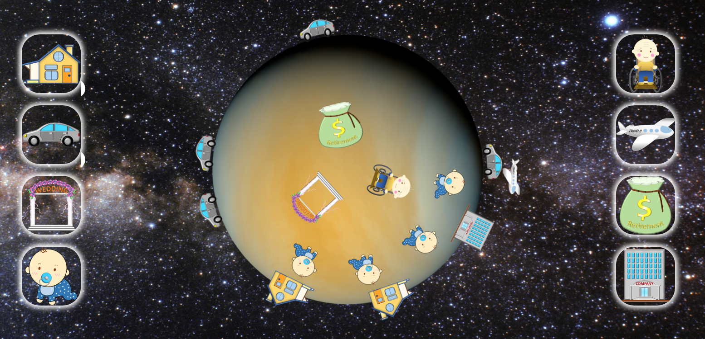
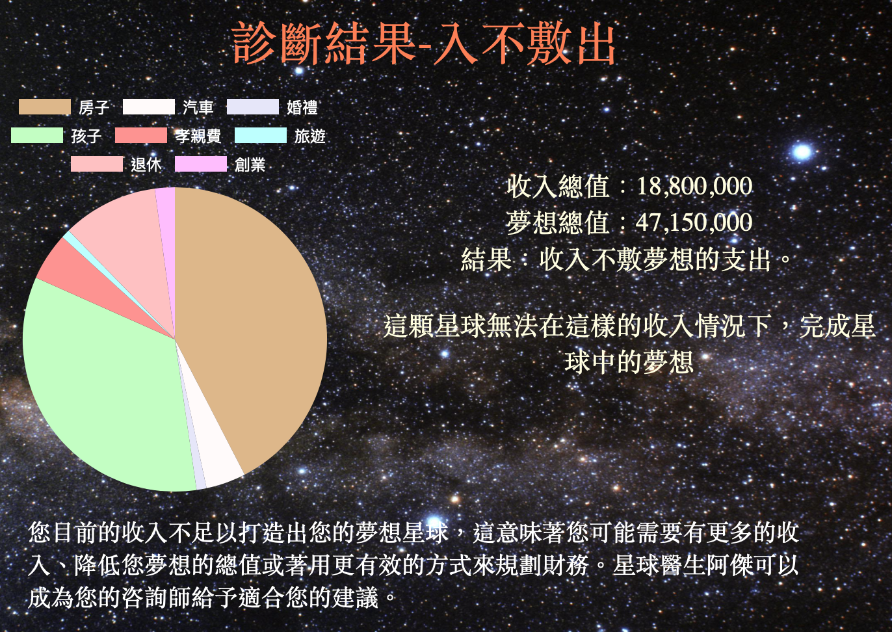

# fin-man-planet
**Demo Page**

final project in AppWorks School
[planet demo](https://jacky0707.github.io/fin-man-planet/)

 
 ## Technologies
 * HTML/CSS/JavaScript
 * animations by: CSS keyframes/transition, javascript
 * Chart.js
 * Unit test: mocha
 
 ## Usage
 By obtaining user's salary and living conditions and things they need for ideal life, this website could caculate the feasibility of the situation for now.
 
 ## demonstrate picture
 </img>
 
 </img>
